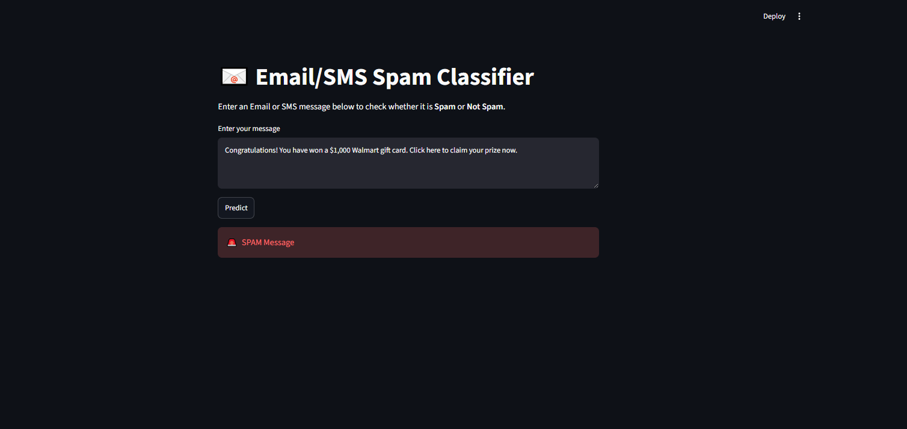

# Email Spam Classifier 📧

A simple Machine Learning based Email/SMS Spam Classifier built with Python and Streamlit.

## Features

- Detect Spam and Not Spam messages
- Text preprocessing using NLTK
- TF-IDF text vectorization
- Machine Learning prediction
- Simple Streamlit UI


## Tech Stack

- Python
- Streamlit
- NLTK
- Scikit-learn
- TF-IDF


## Project Structure

```
Spam-Classifier/

│
├── app.py
├── model.pkl
├── vectorizer.pkl
├── requirements.txt
└── README.md
```


## Installation

Clone the repository:

```bash
git clone https://github.com/talhaleet/Spam-Classifier.git
```

Go into project:

```bash
cd Spam-Classifier
```


Install dependencies:

```bash
pip install -r requirements.txt
```


## Run Application

```bash
streamlit run app.py
```

## Screenshot




## How it Works

1. User enters an Email/SMS message.
2. Text is cleaned and processed.
3. TF-IDF converts text into numerical features.
4. ML model predicts Spam or Not Spam.


## Author

Muhammad Talha
